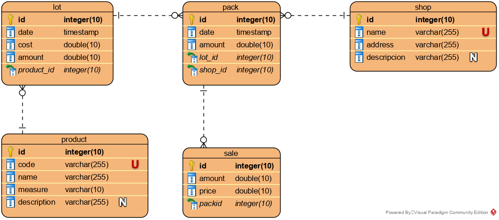

# Product Store Api
## Description
Management system for a local shop business. It helps owners to supervise and control the life cycle of the products they sell, from the moment they are received to when they are sold.

## Functional requirements 
- Products management
- Shops management
- Product existence on the main warehouse, for all and for specific product
- Product existence in a shop, for all and for specific product
- History of products received on the main warehouse in a lapse of time, filtering by product
- History of products delivered to shops in a lapse of time, filtering by product and shop
- History of sales in shops in a lapse of time, filtering by product and shop
- Get balance in a lapse of time, filtering by product and shop

## API Definition
| Action                                               | URL                                        | Method | Parameters                       |
|------------------------------------------------------|--------------------------------------------|--------|----------------------------------|
| List all products                                    | /product                                   | GET    |                                  |
| Add a product                                        | /product                                   | POST   | code, name, measure, description |
| Get a product information                            | /product/{product_id}                      | GET    |                                  |
| UpLocalDateTime a product information                | /product/{product_id}                      | PUT    | code, name, measure, description |
| Delete a product                                     | /product/{product_id}                      | DELETE |                                  |
| List all shops                                       | /shop                                      | GET    |                                  |
| Add a shop                                           | /shop                                      | POST   | name, address, description       |
| Get a shop information                               | /shop/{shop_id}                            | GET    |                                  |
| UpLocalDateTime a shop information                   | /shop/{shop_id}                            | PUT    | name, address, description       |
| Delete a shop                                        | /shop/{shop_id}                            | DELETE |                                  |
| History of receipts with filters                     | /lot                                       | GET    | start, end, product_id           |
| Register a product receipt                           | /lot                                       | POST   | date, cost, amount, product_id   |
| Delete a product receipt record                      | /lot/{lot_id}                              | DELETE |                                  |
| History of deliveries with filters                   | /pack                                      | GET    | start, end, product_id, shop_id  |
| Register a product delivery                          | /pack                                      | POST   | date, amount, lot_id, shop_id    |
| Delete a product delivery record                     | /pack/{pack_id}                            | DELETE |                                  |
| History of sales with filters                        | /sale                                      | GET    | start, end, product_id, shop_id  |
| Register a sale                                      | /sale                                      | POST   | date, amount, price, pack_id     |
| Delete a sale record                                 | /sale/{sale_id}                            | DELETE |                                  |
| Get existence of each products on the main warehouse | /existence                                 | GET    |                                  |
| Get existence of a product on the main warehouse     | /existence/{product_id}                    | GET    |                                  |
| Get existence of a products on each shop             | /existence/{product_id}/shop               | GET    |                                  |
| Get existence of a product on a shop                 | /existence/{product_id}/shop/{shop}        | GET    |                                  |
| Get net financial balance                            | /balance                                   | GET    | start, end                       |
| Get balances for each product                        | /balance/product                           | GET    | start, end                       |
| Get balances for each shop                           | /balance/shop                              | GET    | start, end                       |
| Get net balance of a product                         | /balance/product/{productId}               | GET    | start, end                       |
| Get net balance of a shop                            | /balance/shop/{shopId}                     | GET    | start, end                       |
| Get balances of a product on each shop               | /balance/product/{productId}/shop          | GET    | start, end                       |
| Get balances for each product on a shop              | /balance/shop/{shopId}/product             | GET    | start, end                       |
| Get net balance of a product on a shop               | /balance/product/{productId}/shop/{shopId} | GET    | start, end                       |

## Database Model

## Deploying the application

- Install and run Docker
- Create a .env file with the required environment variables

      # Port to map the database server out of docker network
      PSA_ORACLE_PORT=1521
      PSA_ORACLE_DB=<database_name>
      PSA_ORACLE_USER=<username>
      PSA_ORACLE_PASS=<password>
      # Port to map the application out of docker network
      PSA_APP_PORT=8080

- Run the application with docker-compose

      docker-compose up -d
